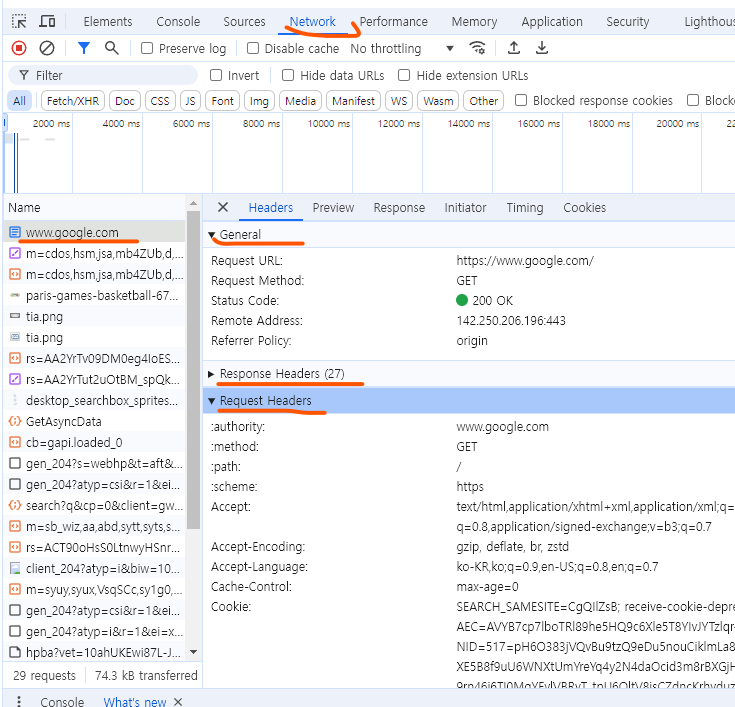

<h3>HTTP</h3>
<ul>
    <li> HTTP란 데이터를 주고 받는 양식을 정의한 "통신 규약" 입니다. </li>
    <li> 통신 규약이란? 컴퓨터끼리 데이터를 주고 받을떄 정해둔 약속을 의미합니다. </li>
    <li> HTTP라는 통신 규약을 이용하여 서버나 클라이언트(브라우저)끼리 의사 소통을 할 수 있게됩니다. </li>
    <li> 모든 브라우저는 HTTP를 지원합니다.</li>
</ul>
<h3>HTTPS</h3>
<ul>
    <li> HTTP 기반으로 데이터 통신의 안전성을 높이기 위해 암호화 기능이 포함된 통신 프로토콜입니다. </li>
    <li> HTTPS는 정보를 '비밀 코드'처럼 암호화 하여 전송합니다. </li>
    <li> 클라이언트와 서버 사이의 데이터가 외부에서 보이지 않게 보안이 됩니다. </li>
    <li> 최근에 대다수의 사이트는 HTTPS를 지원하고 있습니다. </li>
</ul>

<h3>어떻게 HTTP로 데이터를 주고 받을까?</h3>
<ul>
    <li> HTTP에서는 언제나 요청(Request)와 응답(Response)이라는 개념이 존재합니다. </li>
    <li> 1. 브라우저는 서버에게 원하는 페이지(URL등의 정보)를 요구(Request)합니다. 여기서 method(GET)</li>
    <li> 2. 서버는 브라우저가 요청한 페이지가 있는지 확인하고, 있으면 해당 페이지 데이터를 반환(Response)  
    없다면 없다면 없는 페이지에 대한 데이터를 반환합니다. 
    이때 원하는 반환은 성공(200 : 성공을 알리는 상태, 원하는 데이터) 실패(400번대 : 실패를 알리는 상태 특히 404)
    </li>
    <li> 데이터는 어떠한 데이터든 주고 받는게 가능합니다.</li>
</ul>

구글에서 개발자 도구를 이용해 보았습니다. Newtwork에서 www.google.com에서 Headers를 보면   

- General : 가장기본적으로 제공되어야할 정보를 주고 있습니다.
- Responser Headers : 서버가 반환한 데이터의 추가적인 정보를 나타내고 있습니다.
- Request Headders : 브라우저가 서버에 요청할때의 정보를 나타내고 있습니다.

 

### HTTP의 구성요소

**Method** : 주로 GET과, POST를 이용합니다.

- GET : 어떤 리소스를 "가져올때" 사용됩니다. 보통 웹서핑할때나
  아까처럼 다른 사이트에 들어갈때 GET 메서드를 이용해 서버에 요청을 보내 데이터를 가져와 사용합니다.
- POST : 웹 서버에 보통 데이터를 '게시'할 때 사용합니다.
  (회원가입, 게시글 작성 등) 데이터를 추가, 수정, 삭제할때 이용됩니다.

**Header** 추가 데이터 (메타 데이터)

- 브라우저가 어떤 페이지를 원하는지에 대한 정보
- 요청 받은 페이지를 찾았는지
- 성공적으로 찾았는지 (성공여부 상태)
- 의사 표현을 위한 데이터도 모두 Header필드에 들어있습니다.

**Payload** 데이터 (실질적인 데이터)

- 서버가 응답을 보낼 때에는 항상 Payload를 보낼 수 있습니다.
- 클라이언트에서 GET method를 제외하곤 모두 Payload를 보낼 수 있습니다.
- DELETE method에서 Payload를 보낼수있지만, 보통은 Payload를 보내지 않고 있습니다.

 

위에 사진처럼 네트워크창에서 확인할 수 있습니다.
